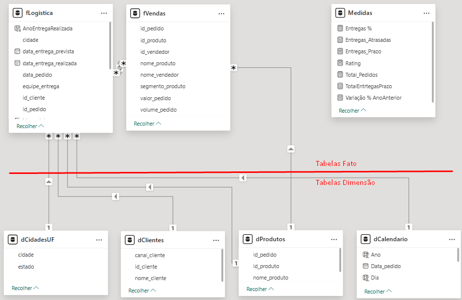

## Análise dos processos logísticos da companhia 

## Visão Geral

*link do vídeo aqui*

**Link para acessar o dashboard no Power BI:** [Dashboard Logística](https://app.powerbi.com/view?r=eyJrIjoiNzBlY2JmMzQtOTc3Yy00Y2VkLWIwNDgtMWZhN2FhMDk3ZmZjIiwidCI6IjE3YzQwY2IwLTI2NmItNGViOC1iMTdjLTZkYzYyMTc4ZDcxOCJ9) 

## Desenvolvimento e ferramental

**Dados** A fonte de dados principal desse projeto é o banco de dados que é abastecido com informações do CRM onde acontece a inserção dos pedidos e é abastecido com informações do sistema SEFAZ onde acontece a emissão das notas fiscais, que por sua vez é tratada pela equipe logística da companhia internamente.
**Manipulação e engenharia** O processo de arquitetura dos dados e o processo de ETL são feitos dentro do Power bi por meio do Power query uma vez que o consumo dos dados é feito por meio de view conectadas ao bd. Os dados são tratados, limpos e manipulados. As tabelas são organizadas usando a distinção FAT e DIM para facilitar a manutenção dos relacionamento e manter a organização. 

## Insights

*Visão Geral*

Com um total de R$ 54 mil de pedido, R$ 47 mil foram entregues. Diante desse volume 16% foram entregues no prazo, o que é bom, mas acende um alerta para os 13% de pedidos entregues com atraso. Mas deixo uma ressalva para os 71% das entregas que foram antecipadas, um bom sinal de eficiência operacional.

*Por Canal de Vendas*

Revenda lidera em volume com R$ 14 Mil entregas dentro do prazo.
Cooperativas e Atacado têm equilíbrio, mas com volume relevante de atrasos.
Distribuição apresenta menor volume, mas atraso proporcionalmente alto.

*Por Região (Equipes) e Cidades*

Norte responde por 51% das entregas dentro do prazo. As cidades de Manaus, Belém e Boa Vista concentram os maiores volumes de atraso. Regiões Norte e Nordeste puxam grande parte dos problemas logísticos por concentrar o maior volume de faturamento, o que não anula os 51% de eficiência nas entregas dentro do prazo e entregues com antecedência.

Regiões Nordeste e Centro-Oeste juntas somam 36% das entregas no prazo, apesar do volume de vendas ser baixo, revela eficiência nas entregas apesar do baixo volume. Sul e Sudeste representa apenas 12% de entregas no prazo, revelando possível gargalo no volume de faturamento nessas regiões.

Concluindo, esses senários não servem de alerta somente para a logística, mas para o comercial como um todo, incluindo marketing estratégico e inteligência de mercado.

*Recomendações Futuras*

> Revisar rotas e transportadoras das cidades com maior índice de atraso (Manaus, Belém, Boa Vista).
> Ajustar o planejamento de prazos já que muitas entregas chegam antes, redefinir SLAs pode aumentar o índice de "no prazo".
> Investir em tecnologia de rastreamento/logística preditiva para reduzir gargalos em cooperativas e atacado.
> Expandir performance do Sul e Sudeste, garantindo maior equilíbrio regional.
> Criar KPIs específicos por canal para monitorar mensalmente os atrasos e antecipações.
